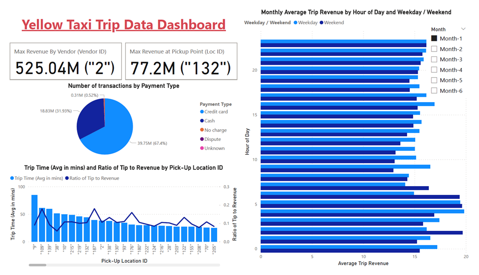

# Big Data Engineering – Hadoop MapReduce for TLC Trip Record Data

This big data engineering project leverages a Hadoop cluster hosted on AWS, utilizing services like RDS and EMR, to analyze New York City's Taxi and Limousine Commission (TLC) trip record data spanning over six months. The project integrates a range of technologies, including Apache HBase for distributed storage, Apache Sqoop for efficient data transfer, and Python for batch data ingestion and performing query tasks. Additionally, Power BI is used for visualizing insights and generating actionable reports.

# Tools used

- AWS Elastic Map Reduce (EMR)
- AWS Relational Data Source (RDS)
- Hadoop Cluster
- Apache HBase
- Apache Sqoop
- Python
- Power BI

# Dataset

Dataset used has 19 columns with millions of records. The duration of data used is January to June for year 2017. Column description is as follows:

| **SN.** | **Field Name** | **Description** |
| --- | --- | --- |
| 1   | VendorID | A code indicating the TPEP provider that provided the record.   1= Creative Mobile Technologies, LLC; 2= VeriFone Inc. |
| 2   | tpep_pickup_datetime | The date and time when the meter was engaged. |
| 3   | tpep_dropoff_datetime | The date and time when the meter was disengaged. |
| 4   | Passenger_count | The number of passengers in the vehicle.   This is a driver-entered value. |
| 5   | Trip_distance | The elapsed trip distance in miles reported by the taximeter. |
| 6   | PULocationID | TLC Taxi Zone in which the taximeter was engaged |
| 7   | DOLocationID | TLC Taxi Zone in which the taximeter was disengaged |
| 8   | RateCodeID | The final rate code in effect at the end of the trip.   1= Standard rate   2=JFK   3=Newark   4=Nassau or Westchester   5=Negotiated fare   6=Group ride |
| 9   | Store_and_fwd_flag | This flag indicates whether the trip record was held in vehicle memory before sending to the vendor, aka “store and forward,” because the vehicle did not have a connection to the server.   Y= store and forward trip   N= not a store and forward trip |
| 10  | Payment_type | A numeric code signifying how the passenger paid for the trip.   1= Credit card   2= Cash   3= No charge   4= Dispute   5= Unknown   6= Voided trip |
| 11  | Fare_amount | The time-and-distance fare calculated by the meter. |
| 12  | Extra | Miscellaneous extras and surcharges. Currently, this only includes the $0.50 and $1 rush hour and overnight charges. |
| 13  | MTA_tax | $0.50 MTA tax that is automatically triggered based on the metered rate in use. |
| 14  | Improvement_surcharge | $0.30 improvement surcharge assessed trips at the flag drop. The improvement surcharge began being levied in 2015. |
| 15  | Tip_amount | Tip amount – This field is automatically populated for credit card tips. Cash tips are not included. |
| 16  | Tolls_amount | Total amount of all tolls paid in trip. |
| 17  | Total_amount | The total amount charged to passengers. Does not include cash tips. |
| 18  | Congestion_Surcharge | Total amount collected in trip for NYS congestion surcharge. |
| 19  | Airport_fee | $1.25 for pick up only at LaGuardia and John F. Kennedy Airports |

For full information about dataset please check the link <https://www.nyc.gov/site/tlc/about/tlc-trip-record-data.page>

# Tasks performed during the case-study

## Task 1: Loading the datasets into an AWS RDS instance

Following activities are performed for loading task:

- Creation of RDS Instance
- Downloading the datasets to master node of EMR cluster
- Loading the datasets
  - Step 1. Initializing DNS names for RDS instance and EMR cluster
  - Step 2. Login to RDS instance from EMR cluster
  - Step 3. Creation of database
  - Step 4. Creation of table schema
  - Step 5. Global variable for importing data from file
  - Step 6. Loading the dataset
  - Step 7. Verifying the imported data

## Task 2: Data Ingestion from RDS to HBase Table using Sqoop

Following activities are performed for data ingestion through Sqoop task:

- Step 1. Switch to root user
- Step 2. Start HBase shell
- Step 3. Create HBase Table
- Step 4. Store password in file for security
- Step 5. Installing MySQL connector for Sqoop
- Step 6. Setting permission for connection to MySQL (This step not required for AWS RDS)
- Step 7. Loading dataset from RDS to HBase using Sqoop
  - Using Sqoop - -import
  - Using Sqoop Job
- Step 8. Verification of Loaded dataset from RDS to HBase
- Step 9. Additional helpful commands for monitoring Sqoop process

## Task 3: Data Ingestion from CSV file to HBase in Batch mode

Following activities are performed for data ingestion in batch mode task:

- Step 1. Setup “Happybase” API
- Step 2. Create Python code using Happybase API
- Step 3. Execution of Python Script to load Batch data to HBase
- Step 4. Verification of data inserted in HBase

## Task 4: Execution of MapReduce Queries

Following MapReduce python code files are prepared to answer specific questions:

- Question 1: Which vendors have the most trips, and what is the total revenue generated by that vendor?
  - [Python code for MapReduce Task a](./all_tasks/mrtask_a.py)
- Question 2: Which pickup location generates the most revenue?
  - [Python code for MapReduce Task b](./all_tasks/mrtask_b.py)
- Question 3: What are the different payment types used by customers and their count? The final results should be in a sorted format.
  - [Python code for MapReduce Task c](./all_tasks/mrtask_c.py)
- Question 4: What is the average trip time for different pickup locations?
  - [Python code for MapReduce Task d](./all_tasks/mrtask_d.py)
- Question 5: Calculate the average tips to revenue ratio of the drivers for different pickup locations in sorted format.
  - [Python code for MapReduce Task e](./all_tasks/mrtask_e.py)
- Question 6: How does revenue vary over time? Calculate the average trip revenue per month - analysing it by hour of the day (day vs night) and the day of the week (weekday vs weekend).
  - [Python code for MapReduce Task f](./all_tasks/mrtask_f.py)

## Task 5: Visualization of Yellow Trip Taxi

Following activities are performed for visualization through Power BI tool:

- Creation of Schema on MySQL (RDS Instance) for storing Outputs
- Export of Outputs of MR Tasks performed to MySQL (RDS Instance) using SQOOP
- Changing Security Group Settings to allow access from Internet
- Establish connection between RDS Instance and Power BI (Desktop)
- Transformations using “Power Query Editor”

# Dashboard Screenshot:

# Final Observations:

Following observations are made through Dashboard:

- Vendor “Verifone Inc.” (code “2”) made maximum revenue among two vendors and total revenue made during first six months of 2017 is 525.04 million.
- Pickup point “132” generate maximum revenue of 77.2 million during first six months of 2017.
- Approx. 2/3 of transaction are done using “Credit card” as payment type. There is very less cases of “No Charge”, “Dispute”, and “Unknown”. There is no instance found for “Voided trip”.
- Average Trip Time is maximum for pick-up location ID “9” followed by “109”, and “139”.
- Among top 25 pick-up locations with average trip time, pick-up location ID “109”, “187”, and “176” have ‘Tip to Revenue’ ration higher than 50%.
- Average Trip Revenue is higher during 04-07 hour of days. Also, there was drop in average trip revenue from Jan-2017 to Feb-2017, and then start growing for day hours from 07 to 22 hour.

# Important Links:
- [Detailed Documentation with Screenshots for Task 1: Loading the datasets into an AWS RDS instance](./all_tasks/RDS.pdf)
- [Python code for Batch Ingestion in Task 3: Data Ingestion from CSV file to HBase in Batch mode](./all_tasks/batch_ingest.py)
- [Detailed Documentation with Screenshots for Task 2: Data Ingestion from RDS to HBase Table using Sqoop and Task 3: Data Ingestion from CSV file to HBase in Batch mode](./all_tasks/Ingestiontask.pdf)
- [Detailed Documentation with Screenshots for Task 4: Execution of MapReduce Queries](./all_tasks/MapReducetasks.pdf)
- [Detailed Documentation with Screenshots for Task 5: Visualization of Yellow Trip Taxi](./all_tasks/Task5.pdf)
